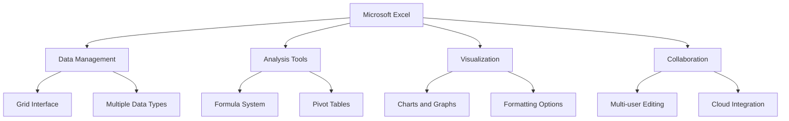
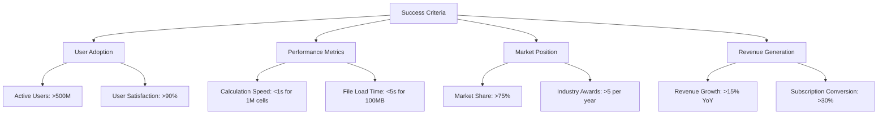
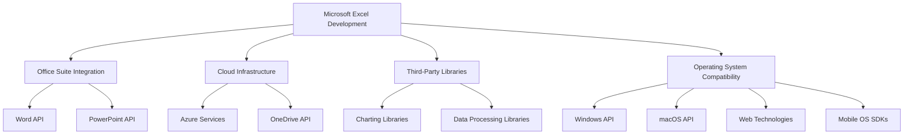
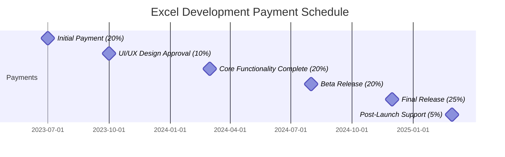
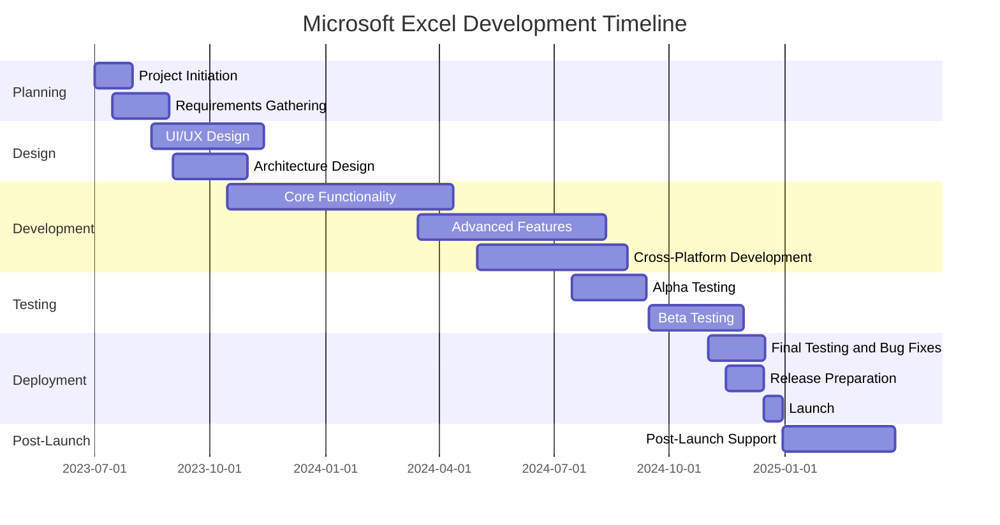
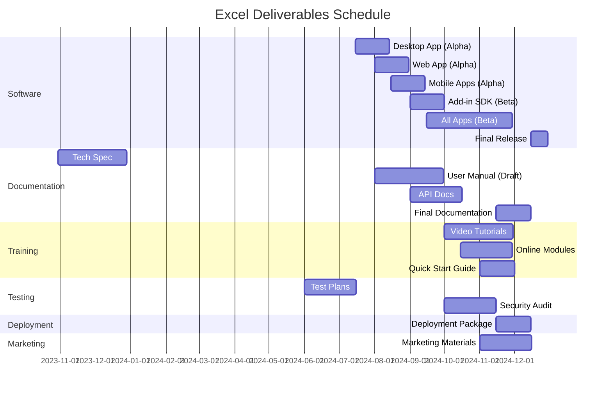

# EXECUTIVE SUMMARY

## PROJECT OVERVIEW

Microsoft Excel is a revolutionary spreadsheet software application designed to transform the way individuals and businesses organize, analyze, and visualize data. In response to the growing need for powerful yet user-friendly data management tools, Excel offers a comprehensive solution that combines intuitive design with advanced functionality. The software addresses the client's need for efficient data handling, complex calculations, and insightful data representation, all within a single, integrated platform.

## OBJECTIVES

1. Develop a robust, grid-based interface for seamless data input and manipulation
2. Implement a comprehensive formula system supporting complex calculations and data analysis
3. Create advanced charting and graphing capabilities for effective data visualization
4. Design an intuitive, ribbon-style toolbar to enhance user experience for both beginners and power users
5. Ensure cross-platform compatibility (Windows, macOS, web, and mobile)
6. Integrate cloud storage and syncing for seamless access across devices
7. Implement collaboration features to support multiple users working simultaneously

## VALUE PROPOSITION

Our agency offers unparalleled expertise in developing sophisticated software solutions that balance power with accessibility. For Microsoft Excel, we bring:

1. Deep understanding of user needs across various proficiency levels
2. Expertise in creating scalable, high-performance applications capable of handling large datasets
3. Experience in developing cross-platform solutions with seamless integration
4. Strong focus on user interface design, ensuring intuitive navigation and feature discovery
5. Proven track record in implementing robust calculation engines and data analysis tools
6. Commitment to ongoing support and feature enhancement based on user feedback and evolving market needs

## PROJECT OBJECTIVES

### BUSINESS GOALS

1. Establish Microsoft Excel as the industry-leading spreadsheet application
2. Increase market share in the productivity software sector
3. Enhance user productivity and efficiency across various industries
4. Drive adoption of the Microsoft Office suite through Excel's integration
5. Generate recurring revenue through subscription-based licensing models
6. Expand the user base by catering to both novice and advanced users
7. Foster a robust ecosystem of third-party add-ins and integrations

### TECHNICAL GOALS

1. Develop a high-performance calculation engine capable of handling large datasets
2. Implement a scalable and extensible formula system supporting complex operations
3. Create an intuitive, ribbon-style user interface for improved feature discoverability
4. Ensure cross-platform compatibility (Windows, macOS, web, and mobile)
5. Integrate cloud storage and real-time collaboration features
6. Optimize memory usage and processing speed for handling large workbooks
7. Implement robust data import/export capabilities supporting various file formats
8. Develop advanced data visualization tools with customizable charts and graphs
9. Create a flexible macro system and VBA environment for user-defined automation
10. Ensure seamless integration with other Microsoft Office applications

### SUCCESS CRITERIA

| Criterion | Target | Measurement Method |
|-----------|--------|---------------------|
| User Adoption | >500 million active users | Monthly Active Users (MAU) tracking |
| User Satisfaction | >90% satisfaction rate | User surveys and app store ratings |
| Performance - Calculation Speed | <1 second for 1 million cells | Automated performance testing |
| Performance - File Load Time | <5 seconds for 100MB file | Automated performance testing |
| Cross-Platform Availability | 100% feature parity | Feature comparison across platforms |
| Market Share | >75% in spreadsheet software category | Third-party market research reports |
| Revenue Growth | >15% year-over-year | Financial reports |
| Third-Party Integrations | >1000 approved add-ins | Microsoft AppSource metrics |
| Collaboration Adoption | >50% of users using co-authoring | Usage analytics |
| Industry Recognition | >5 major industry awards per year | Award tracking and documentation |

These success criteria will be regularly monitored and evaluated throughout the project lifecycle to ensure that Microsoft Excel meets and exceeds its objectives, maintaining its position as the premier spreadsheet application in the market.

## SCOPE OF WORK

### IN-SCOPE

1. User Interface Development
   - Grid-based interface for data input and manipulation
   - Ribbon-style toolbar for easy feature access
   - Customizable quick access toolbar
   - Cell, row, and column formatting options
   - Multiple worksheet support within workbooks

2. Data Management and Analysis
   - Support for various data types (numbers, text, dates, etc.)
   - Sorting and filtering capabilities
   - Data validation tools
   - Pivot table functionality for data summarization
   - Data import/export in multiple formats (CSV, TXT, XML, etc.)

3. Calculation Engine
   - Comprehensive formula system with 400+ built-in functions
   - Custom function creation capability
   - Array formula support
   - Automatic calculation and manual calculation modes

4. Visualization Tools
   - Extensive charting and graphing capabilities (50+ chart types)
   - Conditional formatting for visual data analysis
   - Sparklines for inline data visualization

5. Automation and Extensibility
   - Macro recording and editing
   - VBA environment for custom solutions
   - Add-in support for third-party extensions

6. Collaboration Features
   - Real-time co-authoring
   - Comments and review tools
   - Version history and change tracking

7. Cross-Platform Development
   - Windows desktop application
   - macOS desktop application
   - Web-based version
   - Mobile applications (iOS and Android)

8. Cloud Integration
   - OneDrive integration for cloud storage
   - Automatic saving and syncing across devices

9. Performance Optimization
   - Large dataset handling (up to 1 million rows)
   - Multithreading for improved calculation speed
   - Memory usage optimization

10. Security Features
    - Password protection for workbooks and worksheets
    - Data encryption for sensitive information
    - Information Rights Management (IRM) integration

### OUT-OF-SCOPE

1. Advanced database functionality (beyond basic data management)
2. Full-fledged project management tools
3. Advanced statistical analysis tools (beyond basic statistical functions)
4. Direct integration with non-Microsoft cloud storage services
5. Built-in machine learning or AI capabilities
6. Creation of standalone executable applications from Excel workbooks
7. Direct integration with external hardware devices (beyond standard input/output)
8. Real-time data feeds from external sources (stock tickers, IoT devices, etc.)
9. Built-in version control system (beyond basic version history)
10. Advanced 3D modeling or CAD-like features

### ASSUMPTIONS

1. Microsoft will provide necessary APIs and documentation for Office suite integration
2. The development team has access to required hardware and software resources
3. Third-party libraries and components are available and properly licensed
4. User testing groups are available for feedback throughout the development process
5. Cloud infrastructure (Azure) is available and scalable for cloud-based features
6. Existing Excel file formats (.xls, .xlsx) will remain backward compatible
7. The project has management support and allocated budget for the entire development cycle
8. Regulatory compliance requirements (e.g., GDPR) remain stable during development
9. Target operating systems and devices will support required technologies (e.g., .NET framework)
10. Localization and internationalization resources are available for global deployment

### DEPENDENCIES

| Dependency | Description | Potential Impact |
|------------|-------------|-------------------|
| Office Suite Integration | APIs and protocols for seamless integration with other Office applications | Delays in API updates could affect cross-application features |
| Cloud Infrastructure | Azure services for cloud-based features and storage | Service disruptions could impact cloud-related functionalities |
| Third-Party Libraries | External libraries for specialized functions (e.g., advanced charting) | Library updates or deprecations may require code adjustments |
| Operating System Compatibility | OS-specific APIs and features for cross-platform development | OS updates might necessitate application modifications |
| .NET Framework | Core framework for Windows application development | Version changes could require significant code refactoring |
| Web Technologies | HTML5, CSS3, and JavaScript for web-based version | Web standard evolution may impact web version functionality |
| Mobile OS SDKs | iOS and Android SDKs for mobile app development | SDK updates could require mobile app revisions |
| Localization Services | Translation and cultural adaptation resources | Delays in localization could impact global release schedules |
| Licensing Agreements | Agreements for using proprietary technologies or patents | Changes in licensing terms could affect feature implementation |
| User Testing Groups | Availability of diverse user groups for testing and feedback | Lack of timely feedback could lead to usability issues |

# BUDGET AND COST ESTIMATES

## COST BREAKDOWN

The following table provides a detailed breakdown of the estimated costs for the Microsoft Excel development project:

| Category | Description | Cost (USD) |
|----------|-------------|------------|
| Labor | Software Development (50 developers x 18 months) | $13,500,000 |
| Labor | UI/UX Design (10 designers x 12 months) | $1,800,000 |
| Labor | Project Management (5 managers x 18 months) | $1,350,000 |
| Labor | Quality Assurance (20 testers x 12 months) | $2,400,000 |
| Software | Development tools and licenses | $500,000 |
| Hardware | Development and testing equipment | $750,000 |
| Cloud Services | Azure infrastructure for development and testing | $1,000,000 |
| Third-party Services | API integrations and specialized libraries | $400,000 |
| User Testing | Beta testing programs and user feedback collection | $300,000 |
| Training | Staff training on new technologies and methodologies | $200,000 |
| Marketing | Pre-launch marketing and promotional activities | $1,500,000 |
| Contingency | 10% buffer for unforeseen expenses | $2,370,000 |
| **Total** | | **$26,070,000** |

## PAYMENT SCHEDULE

The payment schedule is structured around key project milestones and deliverables:

| Milestone | Percentage | Amount (USD) | Estimated Date |
|-----------|------------|--------------|----------------|
| Project Initiation | 20% | $5,214,000 | July 1, 2023 |
| UI/UX Design Approval | 10% | $2,607,000 | October 1, 2023 |
| Core Functionality Complete | 20% | $5,214,000 | March 1, 2024 |
| Beta Release | 20% | $5,214,000 | August 1, 2024 |
| Final Release | 25% | $6,517,500 | December 1, 2024 |
| Post-Launch Support | 5% | $1,303,500 | March 1, 2025 |

## BUDGET CONSIDERATIONS

Several factors could potentially impact the budget and require careful management:

1. **Scope Creep**: As the project progresses, there may be requests for additional features or functionality. We will implement a strict change control process to evaluate and approve any scope changes, assessing their impact on the budget.

2. **Technology Changes**: Rapid advancements in web and mobile technologies could necessitate adjustments to our development approach. We have allocated a portion of the contingency fund to accommodate potential technology pivots.

3. **Third-Party Integration Costs**: The costs of integrating with third-party services or APIs may fluctuate. We will continuously monitor these costs and seek alternative solutions if necessary.

4. **Performance Optimization**: Achieving the desired performance levels for large datasets may require additional development time or more powerful hardware. The contingency budget includes allowances for potential performance-related issues.

5. **Cross-Platform Development Challenges**: Ensuring consistent functionality across all platforms (Windows, macOS, web, and mobile) may present unforeseen difficulties. We have factored in extra time and resources for cross-platform testing and optimization.

6. **Cybersecurity Measures**: As security requirements evolve, we may need to implement additional security features. A portion of the budget is reserved for potential security enhancements.

7. **User Testing Feedback**: Extensive user testing may reveal the need for significant UI/UX changes. We have allocated resources for potential design iterations based on user feedback.

8. **Regulatory Compliance**: Changes in data protection regulations or industry standards may require additional development work. We will closely monitor regulatory landscapes and adjust our approach as needed.

9. **Cloud Infrastructure Costs**: The actual costs of cloud services may vary based on usage during development and testing. We will implement cloud cost monitoring tools to track and optimize cloud spending.

10. **Exchange Rate Fluctuations**: For any international aspects of the project, currency exchange rate fluctuations could impact costs. We will work with the finance department to implement appropriate hedging strategies if necessary.

To mitigate these risks, we have included a 10% contingency in the budget. Additionally, we will conduct monthly budget reviews to track expenses against projections and make necessary adjustments. Any significant deviations from the planned budget will be promptly communicated to stakeholders, along with proposed mitigation strategies.

# TIMELINE AND MILESTONES

## PROJECT TIMELINE

## KEY MILESTONES

| Milestone | Description | Target Date |
|-----------|-------------|-------------|
| M1: Project Kickoff | Project initiation and team onboarding complete | 2023-07-15 |
| M2: Requirements Finalized | All project requirements documented and approved | 2023-08-30 |
| M3: UI/UX Design Approval | Final user interface designs approved by stakeholders | 2023-11-15 |
| M4: Architecture Sign-off | System architecture and technical design approved | 2023-10-30 |
| M5: Core Functionality Complete | Basic spreadsheet operations and formula system implemented | 2024-04-15 |
| M6: Advanced Features Integration | Charting, pivot tables, and macros functionality added | 2024-08-15 |
| M7: Cross-Platform Compatibility | Excel functional on Windows, macOS, web, and mobile platforms | 2024-08-30 |
| M8: Alpha Release | Internal release for thorough testing and feedback | 2024-09-15 |
| M9: Beta Release | Public beta release for user testing and feedback | 2024-11-30 |
| M10: Final Release Candidate | All features implemented, tested, and bug-fixed | 2024-12-15 |
| M11: Official Launch | Microsoft Excel released to the public | 2024-12-30 |
| M12: Post-Launch Review | Evaluation of launch success and user feedback analysis | 2025-03-30 |

## CRITICAL PATH

The following tasks represent the critical path for the Microsoft Excel development project. Any delays in these tasks could potentially impact the overall project timeline:

1. Requirements Gathering and Analysis
2. Core Architecture Design
3. Development of Basic Spreadsheet Functionality
4. Implementation of Formula System
5. Cross-Platform Development and Integration
6. Beta Testing Phase
7. Final Bug Fixes and Performance Optimization
8. Release Preparation and Deployment

To ensure the project stays on schedule, we will:

1. Allocate additional resources to critical path tasks when necessary
2. Conduct weekly progress reviews focusing on critical path activities
3. Implement a risk management strategy to identify and mitigate potential delays
4. Utilize parallel development tracks where possible to optimize the timeline
5. Maintain open communication channels with all stakeholders to quickly address any issues or changes that may impact the critical path

By closely monitoring these critical path elements and maintaining flexibility in our approach, we aim to deliver Microsoft Excel on time and to the highest quality standards.

# DELIVERABLES

## LIST OF DELIVERABLES

1. Software Components
   - Microsoft Excel Desktop Application (Windows and macOS)
   - Microsoft Excel Web Application
   - Microsoft Excel Mobile Applications (iOS and Android)
   - Excel Add-in SDK for third-party developers

2. Documentation
   - Technical Specification Document
   - User Manual
   - API Documentation
   - System Architecture Document
   - Database Schema Documentation
   - Security and Compliance Documentation

3. Training Materials
   - Video Tutorials
   - Interactive Online Training Modules
   - Quick Start Guide
   - Advanced User Guide
   - Administrator Guide

4. Testing and Quality Assurance
   - Test Plans and Test Cases
   - Bug Reports and Resolution Documentation
   - Performance Test Results
   - Security Audit Report

5. Deployment Package
   - Installation Packages for Desktop Applications
   - Deployment Scripts for Web Application
   - Mobile App Store Submission Packages

6. Marketing Materials
   - Product Brochures
   - Feature Highlight Sheets
   - Case Studies
   - Press Release Kit

## DELIVERY SCHEDULE

## ACCEPTANCE CRITERIA

| Deliverable | Acceptance Criteria |
|-------------|---------------------|
| Desktop Application | - Runs on Windows 10+ and macOS 10.15+ - Supports all specified features - Performs calculations on 1M cells in <1 second - Loads 100MB files in <5 seconds - Passes all security and compliance checks |
| Web Application | - Compatible with latest versions of Chrome, Firefox, Safari, and Edge - 99.9% uptime during peak hours - Supports real-time collaboration for up to 100 simultaneous users - Loads and operates within 3 seconds on standard broadband connection |
| Mobile Applications | - Available on iOS 14+ and Android 10+ - Supports core Excel functionality - Syncs seamlessly with cloud storage - Optimized for both phone and tablet interfaces |
| Add-in SDK | - Comprehensive documentation with code samples - Successfully tested with 10 sample add-ins - Compatible with latest Excel version and two previous major versions |
| Technical Documentation | - Covers all system components and interfaces - Includes detailed API references - Reviewed and approved by technical lead and product manager |
| User Manual | - Covers all user-facing features - Includes step-by-step guides for common tasks - Passes readability assessment for target user base |
| Training Materials | - Covers beginner to advanced topics - Video tutorials are high-quality (1080p) with clear audio - Online modules have an 85% or higher completion rate in user testing |
| Test Plans and Results | - Covers all critical and major features - Includes automated and manual test cases - Test coverage of at least 90% for critical components |
| Security Audit Report | - Identifies and categorizes all potential vulnerabilities - Provides mitigation strategies for identified risks - Complies with industry standard security protocols (e.g., OWASP) |
| Deployment Package | - Successfully installs on clean systems without errors - Includes all necessary dependencies - Provides rollback capability in case of failed installation |
| Marketing Materials | - Aligns with Microsoft brand guidelines - Accurately represents product features and benefits - Approved by marketing and legal departments |

Each deliverable will be subject to a formal review process. Acceptance will be granted only when all criteria are met and signed off by the designated project stakeholders and client representatives.