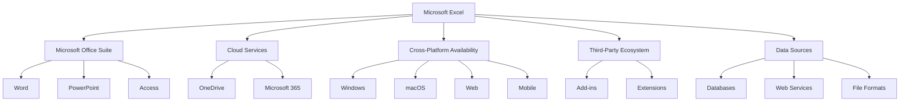
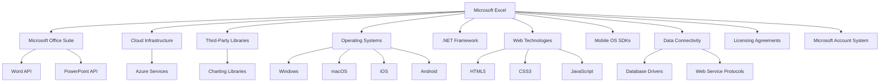
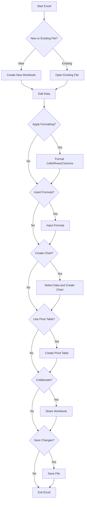
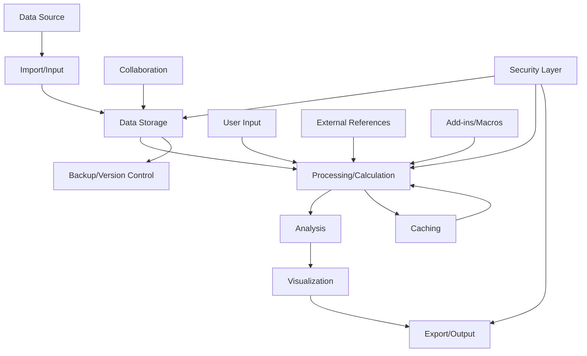

# INTRODUCTION

## PURPOSE

The purpose of this Software Requirements Specification (SRS) document is to provide a comprehensive and detailed description of the Microsoft Excel spreadsheet application. This document serves as the primary reference for the development team, project managers, quality assurance testers, and other stakeholders involved in the creation and deployment of Microsoft Excel.

This SRS aims to:

1. Clearly define the functional and non-functional requirements of Microsoft Excel
2. Establish a shared understanding of the project scope and objectives among all stakeholders
3. Serve as a basis for project planning, cost estimation, and resource allocation
4. Provide a benchmark for validating the final product against the initial requirements
5. Act as a contractual agreement between the development team and Microsoft

The intended audience for this document includes:

- Software developers and engineers
- Project managers and team leads
- Quality assurance and testing teams
- User experience (UX) and user interface (UI) designers
- Technical writers and documentation specialists
- Microsoft executives and product managers
- Third-party integrators and add-in developers
- Legal and compliance teams

## SCOPE

Microsoft Excel is a powerful and versatile spreadsheet application designed to revolutionize data management, analysis, and visualization for individuals and businesses across various industries. As a cornerstone of the Microsoft Office suite, Excel aims to provide an intuitive yet robust platform for handling numerical data, performing complex calculations, and creating insightful visual representations of information.

### Goals

1. Develop a user-friendly interface that caters to both novice and advanced users
2. Create a high-performance calculation engine capable of handling large datasets
3. Implement a comprehensive set of data analysis and visualization tools
4. Ensure seamless cross-platform functionality across desktop, web, and mobile devices
5. Integrate cloud-based features for enhanced collaboration and accessibility
6. Maintain compatibility with existing Excel file formats and third-party integrations

### Benefits

1. Increased productivity through efficient data management and analysis
2. Enhanced decision-making capabilities with advanced data visualization tools
3. Improved collaboration among team members with real-time co-authoring features
4. Accessibility of data and functionality across multiple devices and platforms
5. Reduced learning curve for new users while providing advanced features for power users
6. Seamless integration with other Microsoft Office applications for a cohesive workflow

### Core Functionalities

1. Grid-based Interface
   - Customizable rows, columns, and cells
   - Support for multiple worksheets within a workbook
   - Freeze panes and split views for easier navigation of large datasets

2. Data Input and Management
   - Support for various data types (numbers, text, dates, currencies)
   - Data validation and error checking
   - Sorting and filtering capabilities
   - Find and replace functionality

3. Calculation Engine
   - Comprehensive formula system with 400+ built-in functions
   - Support for array formulas and dynamic arrays
   - Automatic and manual calculation modes
   - Custom function creation through VBA

4. Data Analysis Tools
   - Pivot Tables for data summarization and analysis
   - What-If Analysis tools (Goal Seek, Scenario Manager, Data Tables)
   - Statistical analysis functions
   - Solver add-in for optimization problems

5. Data Visualization
   - Wide range of chart types (50+) for data representation
   - Conditional formatting for visual data analysis
   - Sparklines for inline data visualization
   - Advanced formatting options for cells, rows, and columns

6. Collaboration Features
   - Real-time co-authoring
   - Comments and review tools
   - Version history and change tracking
   - Sharing options with customizable permissions

7. Automation and Extensibility
   - Macro recording and editing capabilities
   - VBA environment for custom solutions and automation
   - Support for third-party add-ins and extensions

8. Cross-Platform Functionality
   - Desktop applications for Windows and macOS
   - Web-based version for browser access
   - Mobile applications for iOS and Android devices

9. Cloud Integration
   - OneDrive integration for cloud storage and syncing
   - Automatic saving and version control
   - Access to files across multiple devices

10. Security and Compliance
    - Password protection for workbooks and worksheets
    - Data encryption for sensitive information
    - Information Rights Management (IRM) integration
    - Compliance with industry standards and regulations

By delivering these core functionalities, Microsoft Excel aims to maintain its position as the leading spreadsheet application in the market, catering to a wide range of users from individual professionals to large enterprises across various industries.

# PRODUCT DESCRIPTION

## PRODUCT PERSPECTIVE

Microsoft Excel is a cornerstone application within the larger Microsoft Office suite, designed to seamlessly integrate with other Office applications while providing powerful standalone functionality. As a spreadsheet software, Excel serves as a critical tool for data management, analysis, and visualization across various industries and user types.

Key aspects of Excel's product perspective include:

1. Integration with Microsoft Office: Excel is tightly integrated with other Office applications such as Word, PowerPoint, and Access, allowing for easy data exchange and embedding of Excel content in other documents.

2. Cloud Ecosystem: Excel is a key component of Microsoft's cloud strategy, leveraging OneDrive for cloud storage and enabling real-time collaboration through Microsoft 365 services.

3. Cross-Platform Availability: Excel is designed to function across multiple platforms, including Windows and macOS desktop environments, web browsers, and mobile devices (iOS and Android).

4. Extensibility: The product serves as a platform for third-party developers to create add-ins and extensions, expanding its functionality beyond core features.

5. Data Ecosystem: Excel acts as a hub for data import/export, connecting with various data sources including databases, web services, and other file formats.



## PRODUCT FUNCTIONS

Microsoft Excel provides a wide range of functions to support data management, analysis, and visualization. The main functions include:

1. Data Input and Management
   - Cell-based data entry and editing
   - Support for various data types (numbers, text, dates, currencies)
   - Data validation and error checking
   - Sorting and filtering capabilities
   - Find and replace functionality

2. Calculation and Formula Engine
   - Comprehensive formula system with 400+ built-in functions
   - Support for array formulas and dynamic arrays
   - Custom function creation through VBA
   - Automatic and manual calculation modes

3. Data Analysis Tools
   - Pivot Tables for data summarization and analysis
   - What-If Analysis tools (Goal Seek, Scenario Manager, Data Tables)
   - Statistical analysis functions
   - Solver add-in for optimization problems

4. Data Visualization
   - Wide range of chart types (50+) for data representation
   - Conditional formatting for visual data analysis
   - Sparklines for inline data visualization
   - Advanced formatting options for cells, rows, and columns

5. Collaboration and Sharing
   - Real-time co-authoring
   - Comments and review tools
   - Version history and change tracking
   - Sharing options with customizable permissions

6. Automation and Extensibility
   - Macro recording and editing capabilities
   - VBA environment for custom solutions and automation
   - Support for third-party add-ins and extensions

7. Data Import/Export
   - Support for various file formats (CSV, XML, JSON, etc.)
   - Connections to external data sources (databases, web services)
   - Data refresh and update capabilities

8. Security and Compliance
   - Password protection for workbooks and worksheets
   - Data encryption for sensitive information
   - Information Rights Management (IRM) integration
   - Compliance with industry standards and regulations

## USER CHARACTERISTICS

Microsoft Excel caters to a diverse user base with varying levels of expertise and requirements. The main user categories include:

1. Novice Users
   - Characteristics: Limited spreadsheet experience, occasional use for basic tasks
   - Needs: Intuitive interface, basic functionality, clear documentation and help resources
   - Persona: Sarah, a small business owner who uses Excel for simple budget tracking and invoice creation

2. Intermediate Users
   - Characteristics: Regular Excel users, familiar with common functions and features
   - Needs: Efficient data manipulation, basic analysis tools, intermediate formulas
   - Persona: Mark, a marketing analyst who uses Excel for campaign performance tracking and reporting

3. Advanced Users
   - Characteristics: Power users with deep Excel knowledge, often in professional roles
   - Needs: Complex analysis tools, advanced formulas, automation capabilities
   - Persona: Lisa, a financial analyst who builds complex financial models and uses advanced Excel features daily

4. Data Scientists / Analysts
   - Characteristics: Highly technical users, often working with large datasets
   - Needs: Advanced statistical functions, integration with other data tools, high performance
   - Persona: David, a data scientist who uses Excel in conjunction with other tools for data preprocessing and quick analyses

5. Developers / IT Professionals
   - Characteristics: Technical users focused on extending Excel's capabilities
   - Needs: VBA environment, API access, integration with other systems
   - Persona: Alex, an IT consultant who develops custom Excel solutions for clients

6. Managers / Executives
   - Characteristics: High-level overview users, often consumers of Excel-based reports
   - Needs: Data visualization, dashboard creation, easy-to-use interface
   - Persona: Jennifer, a CEO who uses Excel-based dashboards for company performance overview

## CONSTRAINTS

1. Technical Constraints
   - Must maintain backward compatibility with previous Excel file formats (.xls, .xlsx)
   - Performance requirements: handle up to 1 million rows of data efficiently
   - Must operate within memory constraints of standard consumer hardware
   - Web version must function across major browsers (Chrome, Firefox, Safari, Edge)

2. Regulatory Constraints
   - Must comply with data protection regulations (e.g., GDPR, CCPA)
   - Need to adhere to accessibility standards (e.g., WCAG 2.1)
   - Financial calculation functions must comply with accounting standards

3. Business Constraints
   - Development must be completed within the allocated budget of $26,070,000
   - Project timeline must meet the planned release date of December 30, 2024
   - Must align with Microsoft's overall product strategy and branding guidelines

4. User Interface Constraints
   - Must maintain consistency with Microsoft Office suite interface design
   - Need to support multiple languages and localization
   - Mobile versions must adapt to smaller screen sizes without losing core functionality

5. Security Constraints
   - Must implement robust encryption for data at rest and in transit
   - Need to integrate with Microsoft's authentication and authorization systems
   - Must provide granular permission controls for shared workbooks

6. Platform Constraints
   - Desktop version must support Windows 10+ and macOS 10.15+
   - Mobile apps must support iOS 14+ and Android 10+
   - Web version must function on devices with minimum 4GB RAM and modern CPUs

## ASSUMPTIONS AND DEPENDENCIES

### Assumptions

1. Users have basic computer literacy and familiarity with spreadsheet concepts
2. The majority of users have access to stable internet connections for cloud-based features
3. Third-party developers will continue to create and maintain add-ins for Excel
4. The core user base will transition to the new version within 18 months of release
5. The existing Excel file format will remain relevant and widely used
6. Users are willing to adopt new features and interface changes
7. The project will have consistent access to necessary development resources and personnel

### Dependencies

1. Microsoft Office Suite: Excel's integration capabilities depend on the development and API stability of other Office applications
2. Cloud Infrastructure: Reliance on Microsoft Azure for cloud-based features and storage
3. Third-Party Libraries: Dependence on external libraries for specialized functions (e.g., advanced charting)
4. Operating System Updates: Excel's functionality may be affected by updates to Windows, macOS, iOS, and Android
5. .NET Framework: Core dependency for Windows application development
6. Web Technologies: Reliance on HTML5, CSS3, and JavaScript standards for the web version
7. Mobile OS SDKs: Dependence on iOS and Android SDKs for mobile app development
8. Data Connectivity: Reliance on database drivers and web service protocols for data import/export features
9. Licensing Agreements: Dependence on continued access to any third-party licensed technologies
10. Microsoft Account System: Reliance on Microsoft's user authentication and license management systems



This diagram illustrates the key dependencies of Microsoft Excel, showcasing the interconnected nature of the product within the larger technology ecosystem.

Here's the PROCESS FLOWCHART section for the Microsoft Excel Software Requirements Specification (SRS) using Mermaid JS:

# PROCESS FLOWCHART

The following flowchart illustrates the high-level process flow for key operations in Microsoft Excel:



This flowchart represents the basic workflow of Microsoft Excel, encompassing the following key processes:

1. Starting Excel and choosing between creating a new workbook or opening an existing file
2. Editing data within the spreadsheet
3. Applying formatting to cells, rows, or columns
4. Inserting formulas for calculations
5. Creating charts for data visualization
6. Using Pivot Tables for data analysis
7. Collaborating with other users by sharing the workbook
8. Saving changes and exiting the application

The flowchart maintains consistency with the previously mentioned features and functionalities of Microsoft Excel, including:

- Support for new and existing files
- Data editing capabilities
- Formatting options
- Formula system
- Charting and graphing features
- Pivot Table functionality
- Collaboration tools
- File saving and management

This high-level process flow provides an overview of how users typically interact with Microsoft Excel, from opening the application to saving their work. It serves as a foundation for more detailed process flows that may be developed for specific features or use cases within the application.

Here's a breakdown of Microsoft Excel's features with the requested sub-sections:

1. Grid Interface

ID: F001
DESCRIPTION: The core spreadsheet interface with cells, rows, and columns for data input and manipulation.
PRIORITY: High

| Requirement ID | Requirement Description |
|----------------|--------------------------|
| F001-1 | Support for at least 1,048,576 rows and 16,384 columns |
| F001-2 | Cell merging and splitting capabilities |
| F001-3 | Freeze panes functionality for easier navigation |
| F001-4 | Multiple worksheet support within a single workbook |
| F001-5 | Customizable column widths and row heights |

2. Data Types and Formatting

ID: F002
DESCRIPTION: Support for various data types and cell formatting options.
PRIORITY: High

| Requirement ID | Requirement Description |
|----------------|--------------------------|
| F002-1 | Support for text, numbers, dates, times, and currency data types |
| F002-2 | Custom number formatting options |
| F002-3 | Conditional formatting based on cell values or formulas |
| F002-4 | Cell styles and themes for consistent formatting |
| F002-5 | Format painter tool for copying formatting between cells |

3. Formula System

ID: F003
DESCRIPTION: Comprehensive formula system for calculations and data analysis.
PRIORITY: High

| Requirement ID | Requirement Description |
|----------------|--------------------------|
| F003-1 | Support for at least 400 built-in functions across various categories |
| F003-2 | Array formula capabilities |
| F003-3 | Nested formula support with up to 64 levels |
| F003-4 | Automatic and manual calculation modes |
| F003-5 | Formula error checking and debugging tools |

4. Data Analysis Tools

ID: F004
DESCRIPTION: Advanced tools for data analysis and summarization.
PRIORITY: Medium

| Requirement ID | Requirement Description |
|----------------|--------------------------|
| F004-1 | Pivot Table functionality for data summarization |
| F004-2 | Data validation tools with customizable rules |
| F004-3 | Goal Seek and Scenario Manager for what-if analysis |
| F004-4 | Solver add-in for complex optimization problems |
| F004-5 | Statistical analysis functions and tools |

5. Charts and Graphs

ID: F005
DESCRIPTION: Visualization tools for creating charts and graphs from data.
PRIORITY: High

| Requirement ID | Requirement Description |
|----------------|--------------------------|
| F005-1 | Support for at least 50 different chart types |
| F005-2 | Customizable chart elements (titles, legends, axes, etc.) |
| F005-3 | Dynamic charts that update with data changes |
| F005-4 | Sparklines for inline data visualization |
| F005-5 | 3D chart capabilities for supported chart types |

6. Data Management

ID: F006
DESCRIPTION: Tools for organizing, sorting, and filtering data within spreadsheets.
PRIORITY: High

| Requirement ID | Requirement Description |
|----------------|--------------------------|
| F006-1 | Multi-level sorting capabilities |
| F006-2 | Advanced filtering options including custom filters |
| F006-3 | Data deduplication tools |
| F006-4 | Text-to-columns feature for data parsing |
| F006-5 | Find and replace functionality with support for regular expressions |

7. Collaboration Features

ID: F007
DESCRIPTION: Tools enabling multiple users to work on the same spreadsheet simultaneously.
PRIORITY: Medium

| Requirement ID | Requirement Description |
|----------------|--------------------------|
| F007-1 | Real-time co-authoring with user presence indicators |
| F007-2 | Comments and review tools |
| F007-3 | Version history and change tracking |
| F007-4 | Sharing options with customizable permissions |
| F007-5 | Integration with Microsoft Teams for enhanced collaboration |

8. Automation and Extensibility

ID: F008
DESCRIPTION: Features allowing users to automate tasks and extend Excel's functionality.
PRIORITY: Medium

| Requirement ID | Requirement Description |
|----------------|--------------------------|
| F008-1 | Macro recording and editing capabilities |
| F008-2 | VBA environment for custom solutions and automation |
| F008-3 | Support for third-party add-ins and extensions |
| F008-4 | Office JavaScript API for web and desktop add-ins |
| F008-5 | Power Query for advanced data import and transformation |

9. Cross-Platform Functionality

ID: F009
DESCRIPTION: Consistent functionality across different platforms and devices.
PRIORITY: High

| Requirement ID | Requirement Description |
|----------------|--------------------------|
| F009-1 | Feature parity between Windows and macOS desktop versions |
| F009-2 | Web version with core functionality accessible via browsers |
| F009-3 | Mobile apps for iOS and Android with touch-optimized interface |
| F009-4 | Seamless transition between devices with cloud sync |
| F009-5 | Offline mode with sync on reconnection |

10. Security and Compliance

ID: F010
DESCRIPTION: Features ensuring data security and regulatory compliance.
PRIORITY: High

| Requirement ID | Requirement Description |
|----------------|--------------------------|
| F010-1 | Password protection for workbooks and worksheets |
| F010-2 | Data encryption for sensitive information |
| F010-3 | Information Rights Management (IRM) integration |
| F010-4 | Compliance with GDPR, CCPA, and other relevant regulations |
| F010-5 | Audit logging for tracking user actions and changes |

This feature breakdown maintains consistency with the previously mentioned technologies and frameworks, including the use of VBA for automation, JavaScript API for add-ins, and cloud integration for cross-platform functionality. The features cover the core aspects of Microsoft Excel while addressing the needs of various user types, from beginners to advanced users.

# NON-FUNCTIONAL REQUIREMENTS

## PERFORMANCE

1. Calculation Speed
   - The application must perform calculations on 1 million cells in less than 1 second on a standard desktop computer (Intel i5 or equivalent, 8GB RAM).
   - Formula recalculation for a 10MB workbook should complete in less than 2 seconds.

2. File Operations
   - Excel must open a 100MB file in less than 5 seconds on a standard desktop computer.
   - Saving a 50MB workbook should take no more than 3 seconds.

3. Memory Usage
   - The desktop application should use no more than 2GB of RAM for workbooks up to 100MB in size.
   - Memory usage should scale linearly for larger files, not exceeding 8GB for 1GB workbooks.

4. Responsiveness
   - User interface actions (e.g., selecting cells, entering data) should have a response time of less than 100ms.
   - Chart rendering should complete within 2 seconds for datasets up to 100,000 points.

5. Concurrent Users (Web Version)
   - The web application must support at least 10,000 concurrent users with less than 10% performance degradation.
   - Real-time collaboration features should support up to 100 simultaneous users per workbook with less than 500ms latency.

## SAFETY

1. Data Integrity
   - The application must maintain data integrity in case of unexpected shutdowns or crashes.
   - Auto-save functionality should create recoverable versions every 5 minutes by default.

2. Error Handling
   - Critical errors must be logged with detailed information for troubleshooting.
   - The application should gracefully degrade functionality rather than crash completely in case of non-critical errors.

3. Backup and Recovery
   - The application must support automated backup to OneDrive or local storage.
   - A file recovery mechanism must be available to restore workbooks from the last five auto-saved versions.

4. Resource Monitoring
   - The application should monitor system resources and warn users when approaching critical limits (e.g., low disk space, high memory usage).

5. Fail-safe Calculations
   - Circular references in formulas must be detected and reported to prevent infinite calculation loops.
   - The application should provide options to limit calculation time or iterations to prevent system freezes due to complex calculations.

## SECURITY

1. Authentication
   - Support for multi-factor authentication (MFA) integration with Microsoft Account.
   - Single Sign-On (SSO) capability for enterprise environments using Azure Active Directory.

2. Authorization
   - Granular permission controls for shared workbooks, allowing cell-level, sheet-level, and workbook-level access control.
   - Integration with Information Rights Management (IRM) for enterprise-level document protection.

3. Data Encryption
   - All data in transit must be encrypted using TLS 1.3 or higher.
   - Data at rest must be encrypted using AES-256 encryption.
   - Support for end-to-end encryption for highly sensitive workbooks.

4. Privacy
   - Compliance with GDPR, CCPA, and other relevant data protection regulations.
   - User data collection should be opt-in, with clear explanations of data usage.
   - Provide tools for users to export or delete their personal data.

5. Secure Development
   - Adherence to Microsoft Security Development Lifecycle (SDL) practices.
   - Regular security audits and penetration testing, at least twice a year.

## QUALITY

1. Availability
   - The web application must maintain 99.9% uptime during business hours (9 AM to 5 PM in all major time zones).
   - Planned maintenance should be scheduled outside of peak usage hours and limited to 4 hours per month.

2. Maintainability
   - The codebase must adhere to Microsoft's coding standards and best practices.
   - Modular architecture to allow for easy updates and feature additions.
   - Comprehensive unit test coverage of at least 80% for all core functionality.

3. Usability
   - The user interface must be consistent across all platforms (desktop, web, mobile).
   - Accessibility compliance with WCAG 2.1 Level AA standards.
   - User onboarding process should allow new users to create a basic spreadsheet within 5 minutes.

4. Scalability
   - The application architecture must support horizontal scaling to handle increased user load.
   - Database design should efficiently handle workbooks with up to 1 million rows and 16,384 columns.

5. Reliability
   - Mean Time Between Failures (MTBF) should exceed 720 hours of operation.
   - Automated error reporting and diagnostics to quickly identify and resolve issues.
   - Failover mechanisms for critical services with a Recovery Time Objective (RTO) of less than 5 minutes.

## COMPLIANCE

1. Legal Compliance
   - Adherence to software licensing agreements for all third-party components.
   - Compliance with export control regulations for cryptography features.

2. Regulatory Compliance
   - GDPR compliance for handling personal data of EU citizens.
   - CCPA compliance for California residents' data rights.
   - HIPAA compliance for workbooks containing health information (optional feature for healthcare industry).

3. Standards Compliance
   - ISO/IEC 27001 compliance for information security management.
   - Compliance with WCAG 2.1 Level AA for web accessibility.
   - Adherence to ECMA-376 standard for Office Open XML file formats.

4. Industry-Specific Compliance
   - SOX compliance features for financial reporting workbooks.
   - FDA 21 CFR Part 11 compliance for electronic records in regulated industries (optional feature).

5. Audit and Reporting
   - Built-in audit trails for all data modifications in shared workbooks.
   - Compliance reporting tools to generate necessary documentation for regulatory audits.

6. Localization and Internationalization
   - Support for all major languages and regional settings.
   - Compliance with local data sovereignty laws for cloud storage options.

These non-functional requirements align with the previously mentioned technologies and frameworks, including the use of Microsoft Azure for cloud services, .NET framework for development, and integration with Microsoft Office suite applications. They ensure that Microsoft Excel meets high standards of performance, safety, security, quality, and compliance across all platforms and use cases.

# DATA REQUIREMENTS

## DATA MODELS

Microsoft Excel's data model is designed to efficiently handle large volumes of structured and semi-structured data. The core entities and their relationships are represented in the following entity-relationship diagram:

```mermaid
erDiagram
    WORKBOOK ||--|{ WORKSHEET : contains
    WORKSHEET ||--|{ CELL : contains
    CELL ||--o| FORMULA : may_contain
    CELL ||--o| VALUE : contains
    CELL ||--o| STYLE : has
    WORKSHEET ||--o| CHART : may_contain
    WORKSHEET ||--o| PIVOT_TABLE : may_contain
    WORKBOOK ||--o| MACRO : may_contain
    WORKBOOK ||--o| NAME : may_contain
    NAME ||--|{ CELL : references
    CHART ||--|{ SERIES : contains
    SERIES ||--|{ CELL : references
    PIVOT_TABLE ||--|{ CELL : references
    
    WORKBOOK {
        string name
        datetime created_date
        datetime modified_date
        string author
    }
    WORKSHEET {
        string name
        int index
        boolean visible
    }
    CELL {
        string address
        string data_type
    }
    FORMULA {
        string expression
    }
    VALUE {
        string content
    }
    STYLE {
        string font
        string color
        string border
        string number_format
    }
    CHART {
        string type
        string title
    }
    PIVOT_TABLE {
        string name
        string source_range
    }
    MACRO {
        string name
        string code
    }
    NAME {
        string name
        string refers_to
    }
    SERIES {
        string name
        string x_values
        string y_values
    }
```

This data model supports the core functionality of Excel, including:
- Multiple worksheets within a workbook
- Cells with various data types, formulas, and styles
- Charts and pivot tables referencing cell data
- Named ranges for easy data referencing
- Macros for automation and custom functionality

## DATA STORAGE

Excel's data storage strategy is designed to handle large volumes of data efficiently while ensuring data integrity, security, and accessibility.

1. File Formats:
   - Primary format: .xlsx (Office Open XML)
   - Legacy support: .xls (Binary Excel Format)
   - Macro-enabled: .xlsm
   - Template: .xltx and .xltm

2. Local Storage:
   - Files are stored on the user's local file system
   - Temporary files and auto-recovery information stored in a designated temp folder

3. Cloud Storage:
   - Integration with OneDrive for cloud-based storage
   - Support for SharePoint for enterprise-level document management

4. Data Retention:
   - Local files: Retained until deleted by the user
   - Cloud files: Retention policies configurable by organization admins
   - Auto-recovery: Temporary files retained for 4 days by default

5. Redundancy:
   - Cloud storage: Utilizes Azure's geo-redundant storage (GRS) for data replication across multiple data centers
   - Local storage: Encourages users to enable File History (Windows) or Time Machine (macOS) for local backups

6. Backup:
   - Cloud: Automatic versioning and backup through OneDrive
   - Local: Integration with Windows Backup and macOS Time Machine
   - Enterprise: Support for third-party backup solutions via COM interfaces

7. Recovery:
   - Auto-recovery feature for unsaved changes
   - Version history for cloud-stored documents
   - Support for recovering corrupt workbooks through built-in repair tools

8. Scalability:
   - Support for workbooks up to 2GB in size
   - Efficient memory usage through on-demand loading of worksheet data
   - Utilization of disk-based processing for large datasets exceeding available RAM

## DATA PROCESSING

Excel's data processing capabilities are designed to handle complex calculations, data transformations, and analysis tasks efficiently and securely.

1. Calculation Engine:
   - Multi-threaded calculation engine for improved performance
   - Dependency tracking for optimized recalculation of affected cells
   - Support for volatile and non-volatile functions
   - Iterative calculation support for circular references (configurable)

2. Data Import and Export:
   - Support for various file formats (CSV, TXT, XML, JSON, etc.)
   - Power Query for advanced data import and transformation
   - Database connectivity through ODBC and native drivers
   - Web queries for importing data from online sources

3. Data Analysis:
   - Pivot Tables for dynamic data summarization
   - Data analysis tools (Goal Seek, Solver, Scenario Manager)
   - Statistical functions and analysis tools
   - Support for external analysis tools through add-ins

4. Data Security:
   - Encryption of workbook contents using AES-256
   - Password protection for opening, modifying, or viewing specific worksheets
   - Information Rights Management (IRM) integration for enterprise-level control
   - Data Loss Prevention (DLP) policies for identifying and protecting sensitive data

5. Data Flow:



6. Performance Optimization:
   - Intelligent caching of calculation results
   - Asynchronous calculation for non-blocking user interface
   - Parallelization of independent calculations
   - Lazy loading of worksheet data for large workbooks

7. Data Validation:
   - Built-in data validation rules (e.g., number ranges, date ranges, custom formulas)
   - Error checking and highlighting of potential data inconsistencies
   - Structured data types for improved data integrity (e.g., stocks, geography)

8. Auditing and Compliance:
   - Formula auditing tools for tracing dependents and precedents
   - Detailed change tracking and review features
   - Support for industry-specific compliance requirements (e.g., HIPAA, GDPR)

9. Cross-Platform Consistency:
   - Ensuring consistent data processing across desktop, web, and mobile platforms
   - Synchronization of calculation settings and results across devices

10. Extensibility:
    - Support for user-defined functions (UDFs) through VBA and Office JavaScript API
    - Integration with external data processing tools and services
    - Ability to leverage Azure-based services for enhanced data processing capabilities

By implementing these data processing features and security measures, Microsoft Excel ensures efficient, secure, and flexible handling of data across various use cases and industries, while maintaining consistency with the previously mentioned technologies and frameworks.

# EXTERNAL INTERFACES

## USER INTERFACES

Microsoft Excel will provide a user-friendly and intuitive interface across multiple platforms, ensuring consistency in design and functionality. The user interface will be designed to accommodate both novice and advanced users, with easy access to basic features and the ability to discover and utilize more complex functionalities.

Key UI requirements include:

1. Ribbon-style toolbar
   - Organized into logical tabs (e.g., Home, Insert, Page Layout, Formulas, Data, Review, View)
   - Contextual tabs that appear based on selected elements (e.g., Chart Tools, Table Tools)
   - Customizable Quick Access Toolbar for frequently used commands

2. Grid-based worksheet area
   - Resizable columns and rows
   - Freeze panes functionality for easier navigation of large datasets
   - Cell merging and splitting capabilities

3. Formula bar
   - Expandable for editing long formulas
   - Function wizard integration for easy formula construction

4. Sheet tabs
   - Easy navigation between multiple worksheets
   - Color coding and grouping options

5. Status bar
   - Quick calculations (sum, average, count) of selected cells
   - Zoom slider for easy view adjustment

6. Charting interface
   - Interactive chart creation wizard
   - Real-time preview of changes

7. Pivot Table interface
   - Drag-and-drop field arrangement
   - Interactive filtering and sorting options

8. Accessibility features
   - High contrast mode
   - Screen reader compatibility
   - Keyboard navigation support

9. Mobile-optimized interface
   - Touch-friendly controls
   - Simplified ribbon for smaller screens
   - Gesture support for common actions

[Placeholder for UI mockups]

## HARDWARE INTERFACES

While Microsoft Excel is primarily a software application, it will interface with various hardware components to ensure optimal performance and user experience:

1. Display adapters
   - Support for high-resolution displays (4K and above)
   - Multi-monitor support with independent window management

2. Input devices
   - Keyboard input for data entry and shortcuts
   - Mouse/trackpad support for navigation and selection
   - Touch screen support for mobile and tablet devices
   - Stylus input support for digital ink annotations

3. Storage devices
   - Fast read/write operations for local file storage
   - Support for external storage devices (USB drives, external hard drives)

4. Processors
   - Utilization of multi-core processors for parallel calculations
   - Support for hardware acceleration where available (e.g., GPU acceleration for certain operations)

5. Memory
   - Efficient memory management to handle large datasets
   - Support for high-capacity RAM configurations

6. Network adapters
   - Utilization of available network bandwidth for cloud storage and real-time collaboration features

7. Printers
   - Support for various printer types and models
   - Custom paper size and orientation settings

## SOFTWARE INTERFACES

Microsoft Excel will interact with various software systems and components to provide a comprehensive and integrated user experience:

1. Operating Systems
   - Windows 10 and above
   - macOS 10.15 (Catalina) and above
   - iOS 14 and above
   - Android 10 and above

2. Microsoft Office Suite
   - Seamless data exchange with Word, PowerPoint, and Access
   - Consistent UI elements and behaviors across the suite

3. Cloud Storage Services
   - OneDrive integration for file storage and synchronization
   - SharePoint integration for enterprise-level document management

4. Database Management Systems
   - ODBC support for connecting to various database systems
   - Native drivers for popular databases (e.g., SQL Server, Oracle, MySQL)

5. Web Browsers (for web version)
   - Chrome 90+
   - Firefox 88+
   - Safari 14+
   - Edge 90+

6. Development Environments
   - Visual Basic for Applications (VBA) editor
   - Office JavaScript API for web and desktop add-ins

7. File Systems
   - Support for various file formats (XLSX, XLS, CSV, XML, JSON)
   - File compression and encryption libraries

8. Authentication Systems
   - Microsoft Account integration
   - Azure Active Directory for enterprise environments

9. Third-party Add-ins
   - Support for COM add-ins (desktop)
   - Web add-in support through Office JavaScript API

10. Accessibility Software
    - Compatibility with screen readers (e.g., JAWS, NVDA)
    - Support for voice recognition software

## COMMUNICATION INTERFACES

Microsoft Excel will utilize various communication interfaces to enable data exchange, collaboration, and integration with external services:

1. Network Protocols
   - HTTP/HTTPS for web-based communication
   - WebSocket for real-time collaboration features
   - FTP/SFTP for file transfers where applicable

2. API Interfaces
   - RESTful APIs for integration with web services
   - GraphQL support for efficient data querying
   - OData protocol for standardized data exchange

3. Data Formats
   - JSON for data interchange in web environments
   - XML for legacy system compatibility
   - CSV for simple data exchange

4. Cloud Services Communication
   - Azure Service Bus for message queuing and event-driven architectures
   - Azure Storage API for cloud file operations

5. Real-time Collaboration
   - Operational Transformation (OT) or Conflict-free Replicated Data Type (CRDT) protocols for concurrent editing
   - Presence protocol for user status and activity tracking

6. Email Protocols
   - SMTP for sending emails directly from Excel (e.g., sharing spreadsheets)
   - IMAP/POP3 for potential email data import features

7. Authentication Protocols
   - OAuth 2.0 for secure API authorization
   - SAML for enterprise single sign-on scenarios

8. Synchronization Protocols
   - Microsoft Sync Framework for offline/online data synchronization
   - CalDAV/CardDAV for potential calendar/contact integration features

9. Remote Procedure Calls
   - gRPC for high-performance, cross-platform RPC (e.g., for certain add-in scenarios)

10. Notification Services
    - Web Push Protocol for browser-based notifications
    - Platform-specific push notification services (APNS for iOS, FCM for Android)

These communication interfaces will be implemented with a focus on security, efficiency, and cross-platform compatibility, ensuring that Microsoft Excel can interact seamlessly with a wide range of external systems and services while maintaining data integrity and user privacy.

# APPENDICES

## GLOSSARY

- **Cell**: The basic unit of a spreadsheet, where data is entered and stored.
- **Workbook**: A file that contains one or more worksheets.
- **Worksheet**: A single spreadsheet within a workbook.
- **Formula**: An expression that calculates the value of a cell.
- **Function**: A predefined formula that performs calculations using specific values.
- **Pivot Table**: A data summarization tool that can automatically sort, count, total, or average data stored in a table.
- **Macro**: A recorded sequence of commands or keyboard strokes that can be played back to automate tasks.
- **VBA**: Visual Basic for Applications, a programming language used to create macros in Excel.
- **Ribbon**: The strip of buttons and icons located at the top of the Excel window that allows users to access various features.
- **Chart**: A graphical representation of data in a worksheet.
- **Sparkline**: A small chart contained within a single cell.
- **Conditional Formatting**: A feature that changes the appearance of cells based on their contents.
- **Data Validation**: A feature that restricts the type of data or values that users can enter into a cell.
- **Array Formula**: A formula that performs multiple calculations on one or more sets of values.
- **Named Range**: A name assigned to a cell or range of cells to make formulas easier to understand and maintain.

## ACRONYMS

- **API**: Application Programming Interface
- **CSV**: Comma-Separated Values
- **GDPR**: General Data Protection Regulation
- **CCPA**: California Consumer Privacy Act
- **HIPAA**: Health Insurance Portability and Accountability Act
- **IRM**: Information Rights Management
- **JSON**: JavaScript Object Notation
- **ODBC**: Open Database Connectivity
- **OLE**: Object Linking and Embedding
- **RTO**: Recovery Time Objective
- **SDK**: Software Development Kit
- **SOX**: Sarbanes-Oxley Act
- **SQL**: Structured Query Language
- **SRS**: Software Requirements Specification
- **SSL**: Secure Sockets Layer
- **TLS**: Transport Layer Security
- **UI**: User Interface
- **UX**: User Experience
- **VBA**: Visual Basic for Applications
- **XML**: eXtensible Markup Language

## ADDITIONAL REFERENCES

1. Microsoft Office Developer Documentation: https://docs.microsoft.com/en-us/office/developer/

2. Excel JavaScript API reference: https://docs.microsoft.com/en-us/javascript/api/excel

3. Microsoft Azure Documentation: https://docs.microsoft.com/en-us/azure/

4. .NET Framework Documentation: https://docs.microsoft.com/en-us/dotnet/

5. Web Content Accessibility Guidelines (WCAG) 2.1: https://www.w3.org/TR/WCAG21/

6. OWASP Top Ten Project: https://owasp.org/www-project-top-ten/

7. General Data Protection Regulation (GDPR) official text: https://gdpr-info.eu/

8. California Consumer Privacy Act (CCPA) official resource: https://oag.ca.gov/privacy/ccpa

9. ISO/IEC 27001 Information Security Management: https://www.iso.org/isoiec-27001-information-security.html

10. ECMA-376 Office Open XML File Formats: https://www.ecma-international.org/publications-and-standards/standards/ecma-376/

These additional references provide in-depth information on various technologies, frameworks, and standards mentioned throughout the SRS document. They serve as valuable resources for developers, designers, and other stakeholders involved in the Microsoft Excel project.