# INTRODUCTION

## SYSTEM OVERVIEW

Microsoft Excel is a comprehensive spreadsheet application designed to provide powerful data management, analysis, and visualization capabilities for users across various platforms. As a cornerstone of the Microsoft Office suite, Excel offers a robust set of features that cater to both novice and advanced users in diverse industries.

The system can be broken down into several key components:

1. Core Spreadsheet Engine
2. User Interface
3. Calculation and Formula System
4. Data Analysis Tools
5. Visualization Components
6. Collaboration Features
7. Automation and Extensibility
8. Cross-Platform Functionality
9. Cloud Integration
10. Security and Compliance

Here's a high-level overview of the system architecture:

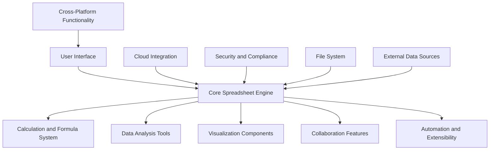

Key features of the system include:

1. Grid-based interface supporting multiple worksheets within a workbook
2. Comprehensive formula system with 400+ built-in functions
3. Advanced data analysis tools including Pivot Tables and What-If Analysis
4. Rich visualization capabilities with 50+ chart types
5. Real-time collaboration and sharing features
6. Macro recording and VBA for automation and custom solutions
7. Cross-platform availability (Windows, macOS, web, and mobile)
8. Cloud integration with OneDrive and Microsoft 365 services
9. Robust security features including encryption and access controls

The system is built using the following key technologies:

- .NET Framework for core application development
- HTML5, CSS3, and JavaScript for web version
- Native iOS and Android SDKs for mobile apps
- Microsoft Azure for cloud services and storage
- Office JavaScript API for add-in development

Excel is designed to handle workbooks up to 2GB in size, supporting up to 1,048,576 rows and 16,384 columns per worksheet. The application aims to provide a seamless experience across devices, allowing users to access and edit their spreadsheets from anywhere.

Integration with other Microsoft Office applications and third-party services enhances Excel's capabilities, making it a versatile tool for data-driven decision-making in personal, educational, and enterprise environments.

# SYSTEM ARCHITECTURE

## PROGRAMMING LANGUAGES

The following programming languages will be used in the development of Microsoft Excel:

| Language | Purpose | Justification |
|----------|---------|---------------|
| C++ | Core application logic, calculation engine | High performance, low-level control, legacy codebase compatibility |
| C# | Windows desktop application, .NET integration | Seamless integration with Windows ecosystem, robust type system |
| Objective-C/Swift | macOS desktop application | Native macOS development, performance, and UI consistency |
| JavaScript | Web version, Office add-ins | Cross-platform compatibility, rich ecosystem for web development |
| TypeScript | Web version, Office add-ins | Enhanced type safety and tooling support for large-scale JavaScript projects |
| Java | Android mobile application | Native Android development, performance, and platform integration |
| Swift | iOS mobile application | Native iOS development, performance, and modern language features |
| Python | Data analysis libraries, scripting | Rapid prototyping, extensive data science libraries, ease of use |
| VBA | Macro programming, backward compatibility | User-created macros, legacy support |
| SQL | Database queries and management | Efficient data retrieval and manipulation for large datasets |

## HIGH-LEVEL ARCHITECTURE DIAGRAM

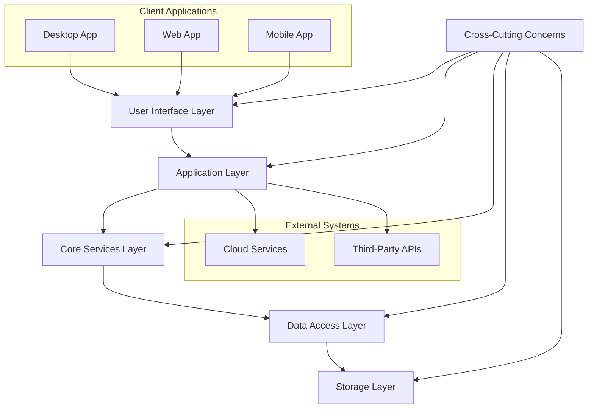

## COMPONENT DIAGRAMS

### Core Application Components

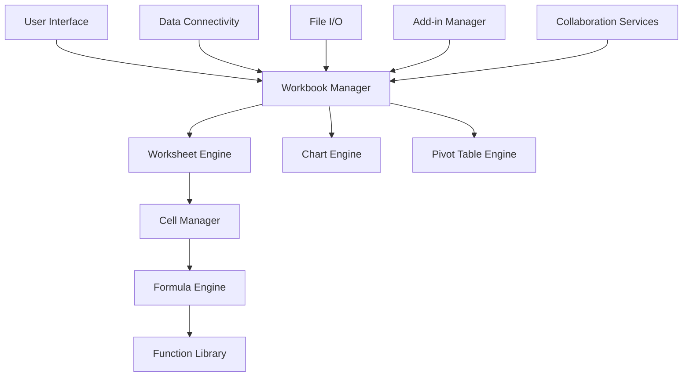

### Web Application Components

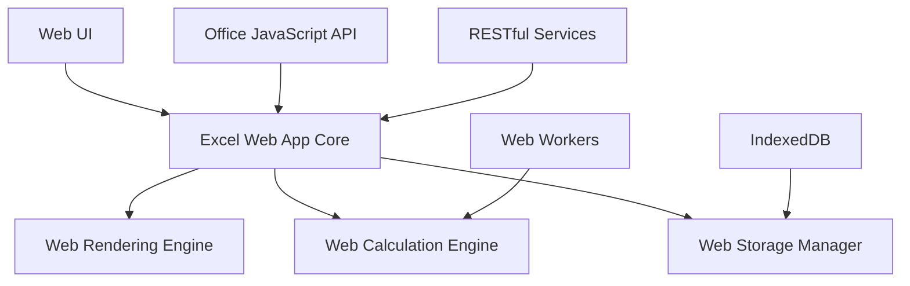

## SEQUENCE DIAGRAMS

### Opening a Workbook

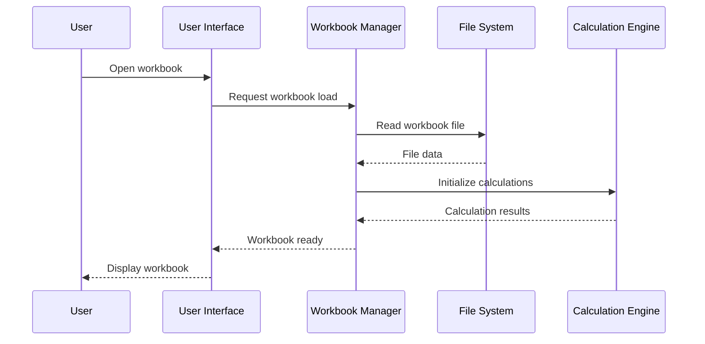

### Real-time Collaboration

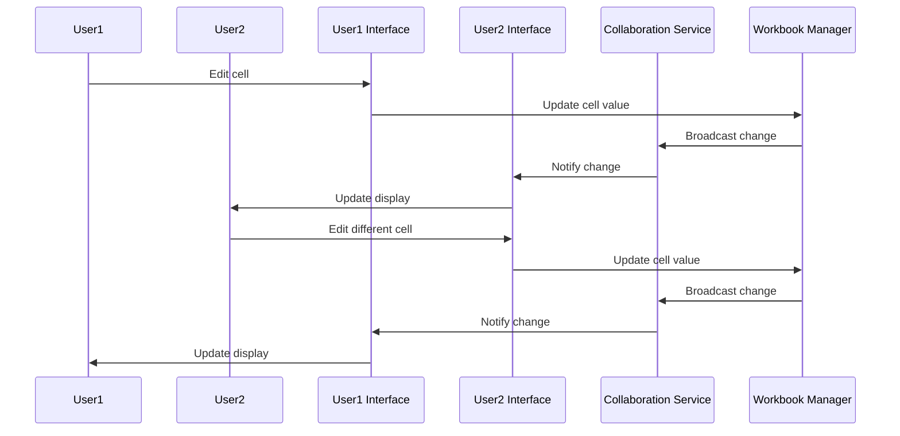

## DATA-FLOW DIAGRAM

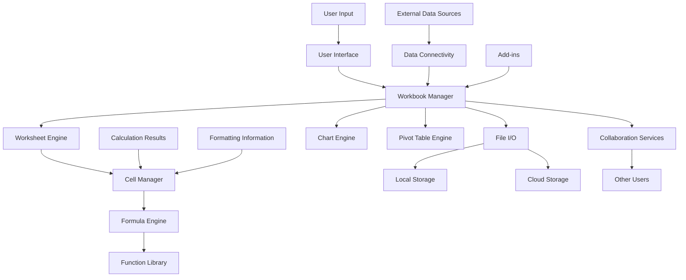

This data-flow diagram illustrates how information moves through the Microsoft Excel system:

1. User input enters through the User Interface.
2. The Workbook Manager coordinates data flow between various components.
3. The Worksheet Engine manages individual sheets within a workbook.
4. The Cell Manager handles individual cell data and properties.
5. The Formula Engine processes calculations, utilizing the Function Library.
6. External data can be imported through Data Connectivity.
7. File I/O manages data persistence to local or cloud storage.
8. Collaboration Services facilitate real-time data sharing between users.
9. Add-ins can interact with and extend the core functionality.
10. Specialized engines handle complex features like charts and pivot tables.
11. Calculation results and formatting information flow back to the Cell Manager for display.

This architecture ensures efficient data processing, real-time updates, and seamless integration of various Excel features while maintaining consistency with the previously mentioned technologies and frameworks.

# SYSTEM DESIGN

## PROGRAMMING LANGUAGES

The following programming languages will be used in the development of Microsoft Excel:

| Language | Purpose | Justification |
|----------|---------|---------------|
| C++ | Core application logic, calculation engine | High performance, low-level control, legacy codebase compatibility |
| C# | Windows desktop application, .NET integration | Seamless integration with Windows ecosystem, robust type system |
| Objective-C/Swift | macOS desktop application | Native macOS development, performance, and UI consistency |
| JavaScript | Web version, Office add-ins | Cross-platform compatibility, rich ecosystem for web development |
| TypeScript | Web version, Office add-ins | Enhanced type safety and tooling support for large-scale JavaScript projects |
| Java | Android mobile application | Native Android development, performance, and platform integration |
| Swift | iOS mobile application | Native iOS development, performance, and modern language features |
| Python | Data analysis libraries, scripting | Rapid prototyping, extensive data science libraries, ease of use |
| VBA | Macro programming, backward compatibility | User-created macros, legacy support |
| SQL | Database queries and management | Efficient data retrieval and manipulation for large datasets |

## DATABASE DESIGN

While Microsoft Excel primarily uses file-based storage for workbooks, it also utilizes databases for certain features and functionalities. The database design will focus on supporting collaborative features, user settings, and caching mechanisms.

### Main Database Tables

1. Users
2. Workbooks
3. Worksheets
4. Cells
5. Styles
6. Formulas
7. Charts
8. PivotTables
9. NamedRanges
10. Comments
11. VersionHistory

### Entity Relationship Diagram

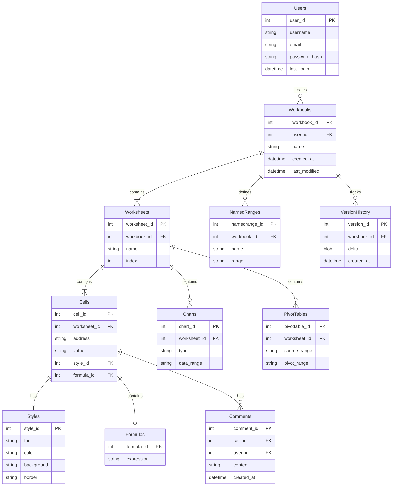

This database design supports the core functionality of Excel while enabling collaborative features and version control. It allows for efficient querying of workbook structures, cell data, and user interactions.

## API DESIGN

Microsoft Excel will expose a set of APIs to enable integration with other applications, extend functionality, and support the development of add-ins. The API design will follow RESTful principles and use JSON for data exchange.

### Core API Endpoints

1. Workbooks
   - GET /api/workbooks
   - POST /api/workbooks
   - GET /api/workbooks/{id}
   - PUT /api/workbooks/{id}
   - DELETE /api/workbooks/{id}

2. Worksheets
   - GET /api/workbooks/{id}/worksheets
   - POST /api/workbooks/{id}/worksheets
   - GET /api/workbooks/{id}/worksheets/{sheet_id}
   - PUT /api/workbooks/{id}/worksheets/{sheet_id}
   - DELETE /api/workbooks/{id}/worksheets/{sheet_id}

3. Cells
   - GET /api/workbooks/{id}/worksheets/{sheet_id}/cells
   - POST /api/workbooks/{id}/worksheets/{sheet_id}/cells
   - GET /api/workbooks/{id}/worksheets/{sheet_id}/cells/{cell_id}
   - PUT /api/workbooks/{id}/worksheets/{sheet_id}/cells/{cell_id}

4. Formulas
   - POST /api/calculate
   - GET /api/functions

5. Charts
   - GET /api/workbooks/{id}/worksheets/{sheet_id}/charts
   - POST /api/workbooks/{id}/worksheets/{sheet_id}/charts
   - GET /api/workbooks/{id}/worksheets/{sheet_id}/charts/{chart_id}
   - PUT /api/workbooks/{id}/worksheets/{sheet_id}/charts/{chart_id}
   - DELETE /api/workbooks/{id}/worksheets/{sheet_id}/charts/{chart_id}

6. PivotTables
   - GET /api/workbooks/{id}/worksheets/{sheet_id}/pivottables
   - POST /api/workbooks/{id}/worksheets/{sheet_id}/pivottables
   - GET /api/workbooks/{id}/worksheets/{sheet_id}/pivottables/{pivot_id}
   - PUT /api/workbooks/{id}/worksheets/{sheet_id}/pivottables/{pivot_id}
   - DELETE /api/workbooks/{id}/worksheets/{sheet_id}/pivottables/{pivot_id}

### API Authentication

The API will use OAuth 2.0 for authentication, allowing secure access to user data and integration with Microsoft accounts.

### WebSocket API

For real-time collaboration features, a WebSocket API will be implemented to handle live updates and synchronization between clients.

## USER INTERFACE DESIGN

The user interface for Microsoft Excel will be designed to be intuitive, efficient, and consistent across different platforms while adapting to the specific requirements of each environment.

### Desktop Application (Windows and macOS)

1. Ribbon Interface
   - Home: Common formatting and editing tools
   - Insert: Options for adding charts, tables, and other objects
   - Page Layout: Document setup and print options
   - Formulas: Formula editing and function library
   - Data: Data import, sorting, and analysis tools
   - Review: Commenting and collaboration features
   - View: Display options and window management
   - Developer: Advanced tools for macros and add-ins

2. Quick Access Toolbar
   - Customizable toolbar for frequently used commands

3. Formula Bar
   - Display and edit cell contents and formulas

4. Worksheet Grid
   - Resizable rows and columns
   - Freeze panes functionality
   - Sheet tabs for multi-sheet navigation

5. Status Bar
   - Quick calculations and view options

### Web Application

1. Simplified Ribbon Interface
   - Collapsible ribbon with core functionality
   - "More options" expandable menus for advanced features

2. Responsive Layout
   - Adapts to different screen sizes and orientations

3. Collaborative Features
   - Real-time presence indicators
   - Commenting and suggestion mode

4. Progressive Web App (PWA) Support
   - Installable on desktop for offline access

### Mobile Application (iOS and Android)

1. Touch-Optimized Interface
   - Large, easily tappable controls
   - Gesture support for common actions (pinch to zoom, swipe to scroll)

2. Simplified Toolbar
   - Context-sensitive toolbar with essential functions

3. Full-Screen Editing Mode
   - Maximizes screen space for content editing

4. Mobile-Specific Features
   - Camera integration for data capture
   - Voice input for hands-free data entry

### Accessibility Considerations

- High contrast mode support
- Screen reader compatibility
- Keyboard navigation for all features
- Customizable font sizes and color schemes

### Mockup: Desktop Ribbon Interface

```
+----------------------------------------------------------------------+
|  File  Home  Insert  Page Layout  Formulas  Data  Review  View  Help |
+----------------------------------------------------------------------+
| [Font] [Size] B I U | $ % , | Merge | Insert | Sort | Find |         |
+----------------------------------------------------------------------+
|    A    |    B    |    C    |    D    |    E    |    F    |    G    |
+----------------------------------------------------------------------+
|  1 |         |         |         |         |         |         |    |
+----------------------------------------------------------------------+
|  2 |         |         |         |         |         |         |    |
+----------------------------------------------------------------------+
|  3 |         |         |         |         |         |         |    |
+----------------------------------------------------------------------+
|  4 |         |         |         |         |         |         |    |
+----------------------------------------------------------------------+
```

This user interface design ensures consistency with the Microsoft Office suite while providing platform-specific optimizations for different devices and form factors. The design prioritizes ease of use, discoverability of features, and efficient workflow for both novice and advanced users.

# TECHNOLOGY STACK

## PROGRAMMING LANGUAGES

The following programming languages will be used in the development of Microsoft Excel:

| Language | Purpose | Justification |
|----------|---------|---------------|
| C++ | Core application logic, calculation engine | High performance, low-level control, legacy codebase compatibility |
| C# | Windows desktop application, .NET integration | Seamless integration with Windows ecosystem, robust type system |
| Objective-C/Swift | macOS desktop application | Native macOS development, performance, and UI consistency |
| JavaScript | Web version, Office add-ins | Cross-platform compatibility, rich ecosystem for web development |
| TypeScript | Web version, Office add-ins | Enhanced type safety and tooling support for large-scale JavaScript projects |
| Java | Android mobile application | Native Android development, performance, and platform integration |
| Swift | iOS mobile application | Native iOS development, performance, and modern language features |
| Python | Data analysis libraries, scripting | Rapid prototyping, extensive data science libraries, ease of use |
| VBA | Macro programming, backward compatibility | User-created macros, legacy support |
| SQL | Database queries and management | Efficient data retrieval and manipulation for large datasets |

## FRAMEWORKS AND LIBRARIES

The following frameworks and libraries will be utilized in the development of Microsoft Excel:

| Framework/Library | Purpose | Justification |
|-------------------|---------|---------------|
| .NET Framework | Windows desktop application development | Comprehensive framework for Windows applications, extensive class libraries |
| WPF (Windows Presentation Foundation) | Windows UI development | Rich UI capabilities, XAML-based design |
| Cocoa/Cocoa Touch | macOS and iOS development | Native frameworks for Apple platforms, consistent user experience |
| React | Web version front-end | Component-based architecture, efficient rendering, large community support |
| ASP.NET Core | Web version back-end | Cross-platform, high-performance framework for web APIs |
| Android SDK | Android mobile application | Comprehensive tools and libraries for Android development |
| NumPy | Numerical computing for data analysis | High-performance numerical operations, integration with C/C++ |
| Pandas | Data manipulation and analysis | Powerful data structures for efficient data handling |
| Chart.js | Web-based charting | Flexible, responsive charts for web version |
| SignalR | Real-time communication | Simplified real-time web functionality for collaboration features |

## DATABASES

The following database systems will be employed in Microsoft Excel:

| Database | Purpose | Justification |
|----------|---------|---------------|
| SQLite | Local data storage for desktop versions | Lightweight, serverless, ideal for local file-based operations |
| SQL Server | Cloud-based data storage, enterprise features | Scalable, robust, deep integration with Microsoft ecosystem |
| Azure Cosmos DB | Global distribution of user data | Multi-model database for globally distributed apps |
| Redis | Caching, real-time data | In-memory data structure store, high performance for real-time operations |

## THIRD-PARTY SERVICES

The following external services and APIs will be integrated into Microsoft Excel:

| Service/API | Purpose | Justification |
|-------------|---------|---------------|
| OneDrive API | Cloud storage and synchronization | Seamless integration with Microsoft's cloud ecosystem |
| Microsoft Graph API | Access to Microsoft 365 services | Unified endpoint for accessing Microsoft 365 data |
| Azure Active Directory | Authentication and authorization | Enterprise-grade identity and access management |
| Bing Maps API | Geographical data and visualization | Integration of location-based data and mapping features |
| Power BI API | Advanced data visualization | Enhanced reporting and dashboard capabilities |
| LinkedIn API | Professional data integration | Access to professional network data for business intelligence |
| Currency Exchange API | Real-time currency conversion | Up-to-date exchange rates for financial calculations |
| Weather API | Weather data integration | Real-time weather data for location-based analysis |

## TECHNOLOGY STACK DIAGRAM

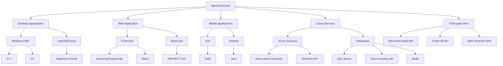

This technology stack ensures a robust, scalable, and feature-rich development environment for Microsoft Excel across all platforms. It leverages Microsoft's existing technologies while incorporating industry-standard tools and services to provide a comprehensive spreadsheet solution.

# SECURITY CONSIDERATIONS

## AUTHENTICATION AND AUTHORIZATION

Microsoft Excel will implement a robust authentication and authorization system to ensure secure access to the application and its features across various platforms.

### Authentication Methods

1. Microsoft Account Integration
   - Single Sign-On (SSO) with Microsoft accounts for personal users
   - Azure Active Directory (Azure AD) integration for enterprise users

2. Multi-Factor Authentication (MFA)
   - Support for SMS, email, and authenticator app-based second factors
   - Integration with Microsoft Authenticator for seamless MFA experience

3. OAuth 2.0 Support
   - For third-party application integrations and add-ins

### Authorization Levels

Excel will implement a role-based access control (RBAC) system with the following default roles:

| Role | Description | Permissions |
|------|-------------|-------------|
| Viewer | Can only view workbooks | Read-only access |
| Editor | Can edit workbooks | Read and write access |
| Reviewer | Can add comments and suggestions | Read access, comment creation |
| Owner | Full control over workbook | All permissions, including sharing and deleting |
| Admin | Organizational-level control | Manage users, set policies, access all workbooks |

Custom roles can be created and managed by organizational admins to fit specific needs.

### Authorization Flow

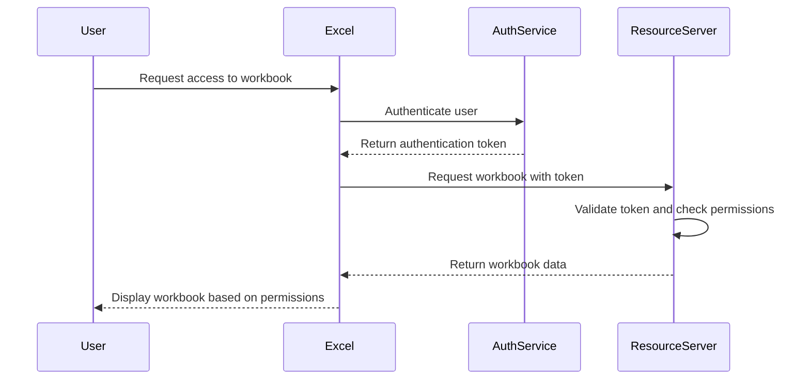

## DATA SECURITY

Excel will implement multiple layers of security to protect sensitive information:

1. Encryption
   - At-rest encryption: AES-256 for local files and cloud storage
   - In-transit encryption: TLS 1.3 for all network communications

2. Data Loss Prevention (DLP)
   - Integration with Microsoft 365 DLP policies
   - Automatic detection and protection of sensitive data types (e.g., credit card numbers, social security numbers)

3. Information Rights Management (IRM)
   - Integration with Azure Information Protection
   - Granular control over document permissions (view, edit, print, copy)

4. Secure Collaboration
   - End-to-end encryption for real-time collaboration sessions
   - Secure sharing links with expiration and password protection

5. Data Residency
   - Support for data residency requirements in cloud deployments
   - Integration with Azure's geo-redundant storage for data replication

6. Audit Logging
   - Comprehensive logging of all data access and modifications
   - Integration with Azure Monitor for advanced log analytics and alerting

## SECURITY PROTOCOLS

Excel will adhere to industry-standard security protocols and best practices:

1. Secure Development Lifecycle (SDL)
   - Implementation of Microsoft's SDL practices throughout the development process
   - Regular security code reviews and penetration testing

2. Vulnerability Management
   - Continuous vulnerability scanning of the codebase
   - Integration with Microsoft's Patch Tuesday cycle for regular security updates

3. Compliance Standards
   - GDPR compliance for handling personal data
   - SOC 2 Type II compliance for cloud services
   - HIPAA compliance for healthcare-related features (optional module)

4. API Security
   - Implementation of OAuth 2.0 and OpenID Connect for API authentication
   - Rate limiting and throttling to prevent API abuse

5. Add-in Security
   - Sandboxed execution environment for third-party add-ins
   - Code signing requirements for add-in developers

6. Network Security
   - Implementation of Web Application Firewall (WAF) for cloud-based services
   - Regular network penetration testing and security assessments

7. Incident Response Plan
   - Clearly defined procedures for handling security incidents
   - Integration with Microsoft's Security Response Center for critical vulnerabilities

8. Security Training
   - Mandatory security awareness training for all development team members
   - Regular phishing simulations and security drills

### Security Architecture

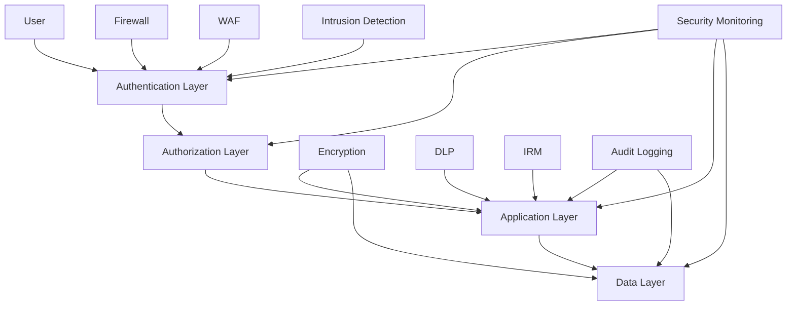

This security architecture ensures that Microsoft Excel maintains a strong security posture across all layers of the application, from user authentication to data storage. By implementing these security considerations, Excel will provide a secure environment for users to work with sensitive data while complying with relevant industry standards and regulations.